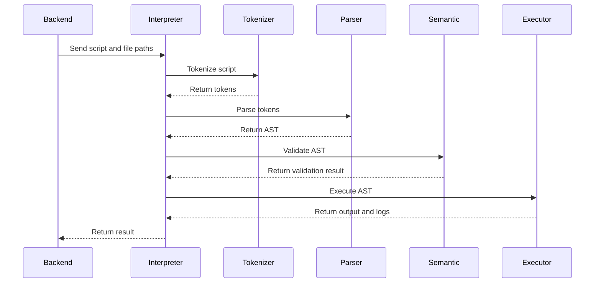

# Convertly Interpreter Architecture

## 1. Overview

The Convertly interpreter is responsible for reading, validating, and executing scripts written in the custom Convertly Domain-Specific Language.

It receives a source file, a DSL script, and a target format from the Spring Boot backend.

The interpreter is developed mainly in **Rust**, with optional **C modules** for low-level file-processing operations.

Its main responsibilities are:

* reading DSL scripts;
* tokenizing the source code;
* parsing the syntax;
* validating semantic rules;
* executing conversion instructions;
* handling execution errors;
* generating output files;
* returning logs and results to the backend.

---

## 2. Global Architecture

The interpreter follows a pipeline architecture.

**DSL Script** => **Tokenizer** => **Parser** => **Semantic Analyzer** => **Execution Engine** => **Format Handlers** => **Generated File**

Each stage has a specific responsibility.

The output of one stage becomes the input of the next stage.

---

## 3. Main Components

### Tokenizer

The tokenizer reads the DSL script and divides it into tokens.

Example input:

```text
load "source.csv"
convert to json
save "result.json"
```

Example tokens:

```text
LOAD
STRING
CONVERT
TO
FORMAT
SAVE
STRING
```

The tokenizer must recognize:

* keywords;
* identifiers;
* strings;
* numbers;
* symbols;
* file formats;
* comments.

---

### Parser

The parser verifies the grammatical structure of the token sequence.

It transforms the tokens into an Abstract Syntax Tree.

```
                   Program
     /================|===============\
     v                v               v
Load Statement Convert Statement Save Statement
```

---

### Semantic Analyzer

The semantic analyzer verifies that the script is logically valid.

It checks:

* whether a file is loaded before conversion;
* whether the target format is supported;
* whether variables are defined;
* whether instructions are used in the correct order;
* whether the requested operation is compatible with the file type.

Syntax validation checks how the script is written.

Semantic validation checks whether the script makes sense.

---

### Execution Engine

The execution engine runs the validated instructions.

It is responsible for:

* opening the source file;
* applying transformations;
* calling the correct format handler;
* generating the output file;
* collecting execution logs;
* stopping execution when an error occurs.

---

### Format Handlers

Each supported file format is managed by a dedicated handler.

A common interface can be used to make it easier to add new formats.

---

## 4. Execution Flow



The interpreter only starts execution after syntax and semantic validation succeed.

---

## 5. Backend Communication

The Spring Boot backend sends a structured request.

```json
{
  "conversionId": "72f76499-d541-49db-8b7e-152d98b4ee19",
  "inputPath": "/data/files/source.csv",
  "outputPath": "/data/files/result.json",
  "targetFormat": "json",
  "script": "load source; convert to json; save result;"
}
```

The interpreter returns a structured response.

```json
{
  "success": true,
  "exitCode": 0,
  "outputPath": "/data/files/result.json",
  "logs": [
    "File loaded",
    "Conversion completed"
  ],
  "error": null
}
```

The interpreter may expose an internal HTTP API or be executed as a controlled process.

Running it as a separate Docker service provides better isolation.

---

## 6. Error Handling

The interpreter must return structured errors instead of crashing.

Main error categories:

```text
TOKENIZATION_ERROR
SYNTAX_ERROR
SEMANTIC_ERROR
UNSUPPORTED_FORMAT
FILE_NOT_FOUND
FILE_READ_ERROR
FILE_WRITE_ERROR
EXECUTION_ERROR
TIMEOUT
```

Example error response:

```json
{
  "success": false,
  "exitCode": 1,
  "outputPath": null,
  "logs": [],
  "error": {
    "code": "SYNTAX_ERROR",
    "message": "Unexpected token",
    "line": 3,
    "column": 8
  }
}
```

Each error should contain:

* an error code;
* a readable message;
* the line number;
* the column number;
* optional execution details.

---

## 7. Rust and C Integration

Rust is used for:

* tokenizer implementation;
* parser implementation;
* semantic analysis;
* execution control;
* error management;
* memory-safe application logic.

C may be used for:

* existing low-level libraries;
* performance-critical file processing;
* format-specific native operations.

Rust communicates with C through Foreign Function Interface bindings.

Unsafe Rust code should be isolated inside dedicated modules.

```text
ffi/
├── mod.rs
├── bindings.rs
└── native_wrapper.rs
```

The rest of the interpreter should remain safe Rust.

---

## 8. Security

The interpreter processes user-provided files and scripts, so execution must be restricted.

Security measures include:

* preventing arbitrary command execution;
* validating all file paths;
* blocking path traversal;
* limiting accessible directories;
* restricting supported instructions;
* setting a maximum execution time;
* limiting memory and CPU usage;
* running inside a Docker container;
* avoiding privileged container execution.

The interpreter must only access the shared conversion directory.

---

## 9. Testing

The interpreter should include tests for:

* token recognition;
* invalid syntax;
* valid syntax;
* semantic validation;
* supported conversions;
* unsupported formats;
* invalid files;
* output generation;
* structured errors.

A complete integration test should execute this flow:

```text
DSL script
→ Tokenization
→ Parsing
→ Semantic validation
→ Execution
→ Output file
```

---

## 10. Architecture Summary

```text
DSL Script
    |
    v
Tokenizer
    |
    v
Parser
    |
    v
Semantic Analyzer
    |
    v
Execution Engine
    |
    v
Format Handler
    |
    v
Output File
```

The tokenizer converts the script into tokens.

The parser creates an Abstract Syntax Tree.

The semantic analyzer verifies the logic of the script.

The execution engine applies the instructions.

Format handlers read and generate supported file formats.

The interpreter returns structured results, logs, and errors to the Spring Boot backend.
