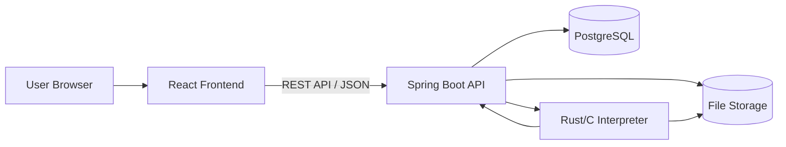
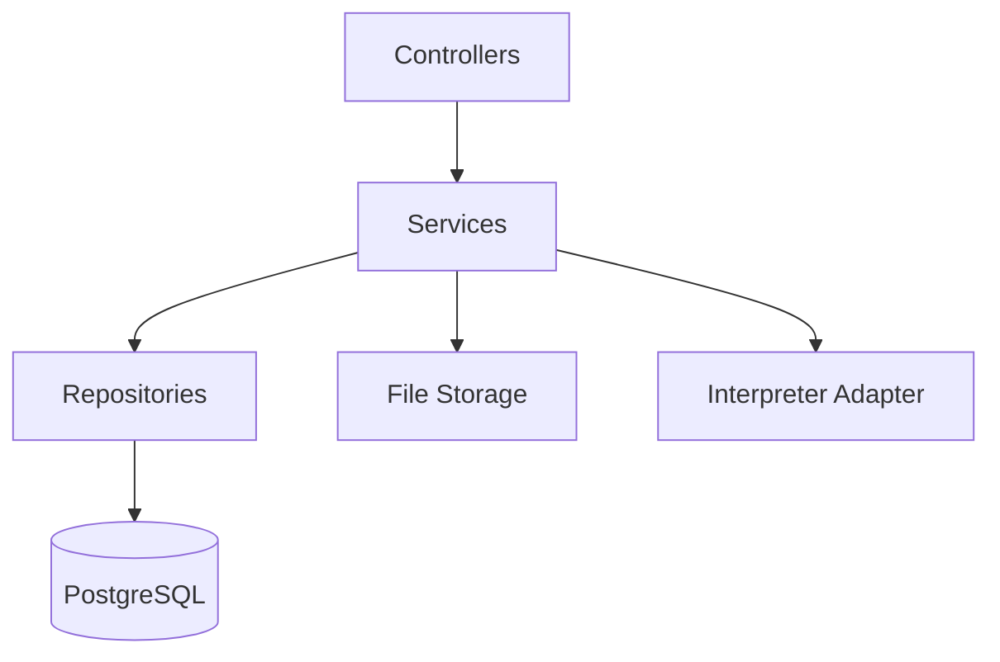
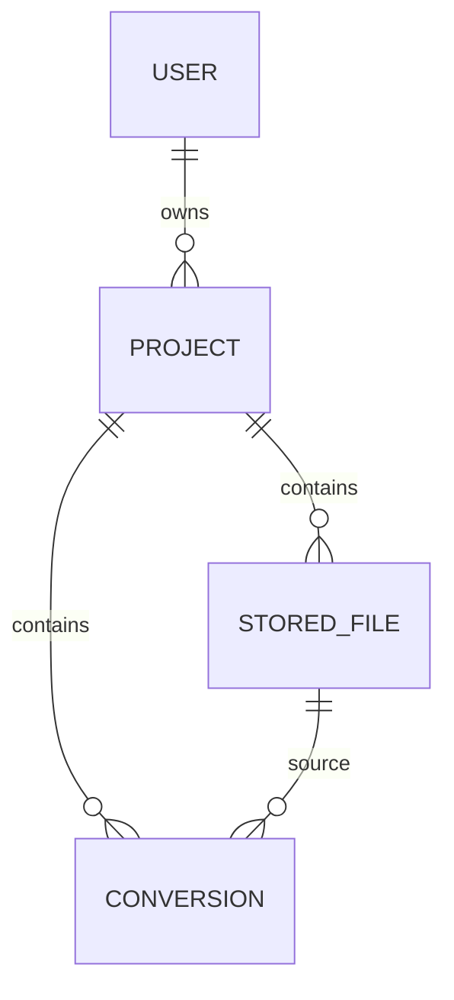

# Convertly Web Architecture

## 1. Overview

Convertly is a web application that allows users to upload, edit, configure, and convert files using a custom Domain-Specific Language.

The web application uses:

* **Frontend:** React, TypeScript, TSX
* **Styling:** Tailwind CSS
* **Backend:** Java with Spring Boot
* **Database:** PostgreSQL
* **Interpreter:** Rust and C
* **Deployment:** Docker

---

## 2. Global Architecture

Convertly follows a client-server architecture.



The frontend communicates only with the Spring Boot backend.

The backend manages authentication, projects, files, database access, and conversion requests.

The interpreter handles the DSL and performs file conversions.

---

## 3. Frontend Architecture

The frontend is built with React, TypeScript, TSX, and Tailwind CSS.

Its responsibilities are:

* user registration and login;
* project management;
* file upload;
* text file editing;
* DSL script editing;
* conversion requests;
* conversion history;
* file download;
* user settings.

The `services` directory contains all REST API calls. Visual components should not communicate directly with the backend.

---

## 4. Backend Architecture

The backend is developed with Spring Boot and follows a layered architecture.



### Controller Layer

Controllers expose REST endpoints and handle HTTP requests.

Examples:

* `AuthController`
* `ProjectController`
* `FileController`
* `ConversionController`

### Service Layer

Services contain the business logic.

They manage:

* authentication;
* permissions;
* projects;
* file operations;
* conversions;
* interpreter communication.

### Repository Layer

Repositories use Spring Data JPA to communicate with PostgreSQL.

Examples:

* `UserRepository`
* `ProjectRepository`
* `StoredFileRepository`
* `ConversionRepository`

---

## 5. PostgreSQL Database

PostgreSQL stores application metadata.

Main entities:

### User

```text
id
email
passwordHash
displayName
role
createdAt
```

### Project

```text
id
ownerId
name
description
createdAt
```

### StoredFile

```text
id
projectId
originalName
storagePath
mimeType
size
createdAt
```

### Conversion

```text
id
projectId
sourceFileId
outputFileId
targetFormat
script
status
errorMessage
createdAt
finishedAt
```



Uploaded files are stored in a Docker volume. PostgreSQL only stores their metadata and internal paths.

---

## 6. REST API

The frontend communicates with the backend through `/api`.

### Authentication

```text
POST /api/auth/register
POST /api/auth/login
POST /api/auth/logout
GET  /api/users/me
```

### Projects

```text
GET    /api/projects
POST   /api/projects
GET    /api/projects/{projectId}
DELETE /api/projects/{projectId}
```

### Files

```text
POST   /api/projects/{projectId}/files
GET    /api/projects/{projectId}/files
GET    /api/files/{fileId}/content
PUT    /api/files/{fileId}/content
GET    /api/files/{fileId}/download
DELETE /api/files/{fileId}
```

### Conversions

```text
POST /api/projects/{projectId}/conversions
GET  /api/projects/{projectId}/conversions
GET  /api/conversions/{conversionId}
GET  /api/conversions/{conversionId}/download
```

---

## 7. Security

Spring Security manages authentication and authorization.

Security measures include:

* hashed passwords;
* protected API routes;
* ownership checks for projects and files;
* file-size limits;
* MIME type verification;
* generated internal filenames;
* path traversal protection;
* interpreter execution timeout;
* restricted Docker permissions.

A user can only access their own projects, files, and conversions.

---

## 8. Docker Deployment

Convertly is divided into several Docker services.

```text
frontend
backend
interpreter
database
reverse-proxy
```

The PostgreSQL database and interpreter are accessible only through the internal Docker network.

---
